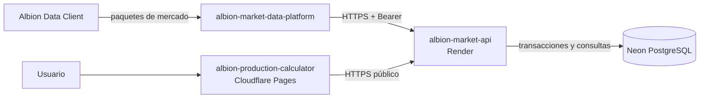
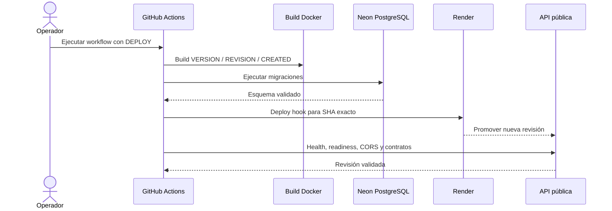

<div align="center">

# Albion Market API

**Backend central de precios e historial para la plataforma de producción de Albion Online.**

[API pública](https://albion-market-api.onrender.com) · [Documentación](https://nachodev-ui.github.io/albion-market-api/) · [Frontend](https://albion-production-calculator.pages.dev)

[](https://github.com/nachodev-ui/albion-market-api/actions/workflows/quality.yml)
[](https://github.com/nachodev-ui/albion-market-api/actions/workflows/contracts.yml)
[](https://github.com/nachodev-ui/albion-market-api/actions/workflows/container.yml)
[](https://github.com/nachodev-ui/albion-market-api/actions/workflows/documentation.yml)
[](https://github.com/nachodev-ui/albion-market-api/actions/workflows/release.yml)

</div>

---

Albion Market API recibe lotes autenticados desde el receiver local, consolida el estado actual y el historial en PostgreSQL, y expone contratos públicos para el frontend. El servicio está diseñado para operar con migraciones controladas, idempotencia, observabilidad y despliegues reproducibles.

> [!NOTE]
> La aplicación web pública no necesita instalar el receiver. `albion-market-data-platform` es una herramienta separada de captura y contribución de datos.

## Papel dentro de la plataforma

| Área | Responsabilidad |
|---|---|
| Ingesta | Recibir precios e historial mediante HTTPS y Bearer authentication |
| Persistencia | Mantener auditoría raw, proyecciones actuales e historial normalizado |
| Consulta | Servir mercados, precios e historial mediante endpoints públicos |
| Operación | Exponer health, readiness, métricas, logs y build metadata |
| Entrega | Migrar Neon antes de promover una revisión exacta en Render |

## Arquitectura del sistema



La topología de producción es hosted-first:

| Componente | Plataforma | Dirección |
|---|---|---|
| Frontend | Cloudflare Pages | `https://albion-production-calculator.pages.dev` |
| API | Render | `https://albion-market-api.onrender.com` |
| API v1 | Render | `https://albion-market-api.onrender.com/api/v1` |
| Base de datos | Neon PostgreSQL | Región AWS São Paulo |

## Capacidades principales

### Ingesta segura y consistente

- autenticación Bearer con rotación de credenciales;
- exigencia de HTTPS en producción;
- idempotencia por `request_id`;
- validación estricta de payloads y límites de tamaño;
- escritura eficiente con `pgx` y transacciones acotadas.

### Modelo de lectura

- catálogo canónico de mercados mediante `marketKey`;
- precios actuales de venta y compra;
- historial de 7 días, 4 semanas o rango personalizado;
- consultas simples y batch;
- separación entre tablas de auditoría y tablas calientes de lectura.

### Operación y observabilidad

- `/healthz` para liveness;
- `/readyz` para pool, PostgreSQL y versión mínima del esquema;
- `/metrics` con formato Prometheus;
- `/api/v1/status` para diagnóstico operativo;
- logs estructurados, correlación HTTP y métricas de build.

## Endpoints principales

| Método | Ruta | Propósito |
|---|---|---|
| `GET` | `/healthz` | Liveness del proceso |
| `GET` | `/readyz` | Readiness del pool, PostgreSQL y esquema |
| `GET` | `/metrics` | Métricas Prometheus y build info |
| `GET` | `/api/v1/status` | Estado operativo y métricas en memoria |
| `GET` | `/api/v1/markets` | Catálogo público de mercados |
| `GET` | `/api/v1/prices` | Consulta simple de precios |
| `POST` | `/api/v1/prices/query` | Consulta batch de precios |
| `GET` | `/api/v1/history` | Consulta simple de historial |
| `POST` | `/api/v1/history/query` | Consulta batch de historial |
| `POST` | `/api/v1/ingest/prices` | Ingesta autenticada de precios |
| `POST` | `/api/v1/ingest/history` | Ingesta autenticada de historial |

La referencia completa está en [API HTTP](https://nachodev-ui.github.io/albion-market-api/api/endpoints).

## Inicio rápido local

### Requisitos

- Go 1.25 o posterior;
- PostgreSQL;
- PowerShell 5.1 o posterior;
- Docker Desktop para pruebas de imagen y Compose.

### Preparación

```powershell
Copy-Item .env.example .env.local

Get-ChildItem .\migrations\*.sql |
    Sort-Object Name |
    ForEach-Object {
        psql $env:DATABASE_URL -v ON_ERROR_STOP=1 -f $_.FullName
    }

go test ./...
go run ./cmd/api
```

La API escucha en `:8080` por defecto:

```powershell
Invoke-RestMethod http://127.0.0.1:8080/healthz
Invoke-RestMethod http://127.0.0.1:8080/readyz
(Invoke-WebRequest http://127.0.0.1:8080/metrics).Content
```

## Despliegue controlado

La configuración declarativa vive en [`render.yaml`](render.yaml) y mantiene el auto-deploy desactivado. El workflow **Deploy production to Render** solo se ejecuta manualmente desde `main` y usa el GitHub Environment `production`.



El Environment `production` contiene:

```text
NEON_MIGRATION_DATABASE_URL
RENDER_DEPLOY_HOOK_URL
```

Los secretos de runtime `DATABASE_URL` e `INGEST_BEARER_TOKEN` permanecen exclusivamente en Render.

> [!IMPORTANT]
> Las migraciones se ejecutan antes de reemplazar la versión activa. Si Neon o cualquier validación previa falla, el workflow no dispara el despliegue.

Guía completa: [Render + Neon en producción](docs/deployment/render-neon-production.md).

## Despliegue local reproducible

```powershell
.\scripts\initialize-deployment.ps1 `
  -AllowedOrigins "https://frontend.example.com"

docker compose `
  --env-file .\deploy\compose.env.local `
  --file .\deploy\compose.yaml `
  up --build --detach
```

Compose espera PostgreSQL saludable, ejecuta las migraciones y solo entonces inicia la API. Los secretos se montan como archivos y no se incorporan a la imagen.

## Estructura del repositorio

```text
.
├─ cmd/
│  ├─ api/              proceso HTTP principal
│  ├─ healthcheck/      sonda incluida en la imagen
│  └─ migrate/          runner de migraciones
├─ internal/
│  ├─ config/           configuración y validaciones
│  ├─ handlers/         contratos HTTP
│  ├─ repository/       persistencia PostgreSQL
│  ├─ service/          reglas de aplicación
│  └─ observability/    logs, métricas y readiness
├─ migrations/          migraciones SQL ordenadas
├─ deploy/              Compose reproducible
├─ observability/       Prometheus, Grafana y Alertmanager
├─ openapi/             contrato canónico
├─ docs/                portal VitePress
├─ scripts/             validación y operación
├─ Dockerfile
└─ render.yaml
```

## Calidad y seguridad

```powershell
go test ./...
go vet ./...
go build ./cmd/api
go build ./cmd/migrate
npm ci
npm run contracts:check
npm run docs:dev
python .\scripts\validate-render-config.py
.\scripts\test-container.ps1
.\scripts\test-deployment-compose.ps1
.\scripts\test-observability-compose.ps1
```

La CI valida formato, race detector, OpenAPI, configuración Render, vulnerabilidades de la imagen, Compose y el stack opcional de observabilidad.

## Distribución verificable

Los tags `vMAJOR.MINOR.PATCH` creados desde el `main` vigente publican una imagen OCI en GitHub Container Registry junto con:

- SBOM SPDX;
- checksums;
- firma Cosign keyless;
- attestations de provenance y SBOM;
- GitHub Release con evidencia descargable.

```text
ghcr.io/nachodev-ui/albion-market-api@sha256:<digest>
```

## Documentación

La documentación técnica completa se publica en [GitHub Pages](https://nachodev-ui.github.io/albion-market-api/).

| Tema | Enlace |
|---|---|
| Inicio rápido | [Guía de inicio](https://nachodev-ui.github.io/albion-market-api/guide/getting-started) |
| Configuración | [Variables y secretos](https://nachodev-ui.github.io/albion-market-api/guide/configuration) |
| API | [Referencia de endpoints](https://nachodev-ui.github.io/albion-market-api/api/endpoints) |
| PostgreSQL | [Base de datos y mantenimiento](https://nachodev-ui.github.io/albion-market-api/database/) |
| Operación | [Observabilidad y alertas](https://nachodev-ui.github.io/albion-market-api/operations/) |
| Despliegue | [Render y Neon](https://nachodev-ui.github.io/albion-market-api/deployment/) |
| Releases | [Firma, verificación y rollback](https://nachodev-ui.github.io/albion-market-api/release/) |

## Repositorios relacionados

| Repositorio | Función |
|---|---|
| [`albion-production-calculator`](https://github.com/nachodev-ui/albion-production-calculator) | Frontend público de cálculo y análisis |
| [`albion-market-data-platform`](https://github.com/nachodev-ui/albion-market-data-platform) | Receiver local, normalización y forwarder |

## Estado del proyecto

El backend está operativo en producción para el alcance actual. El trabajo posterior se concentra en observación de largo plazo, recuperación verificada, mantenimiento y releases estables.